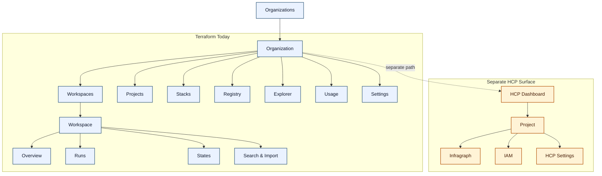
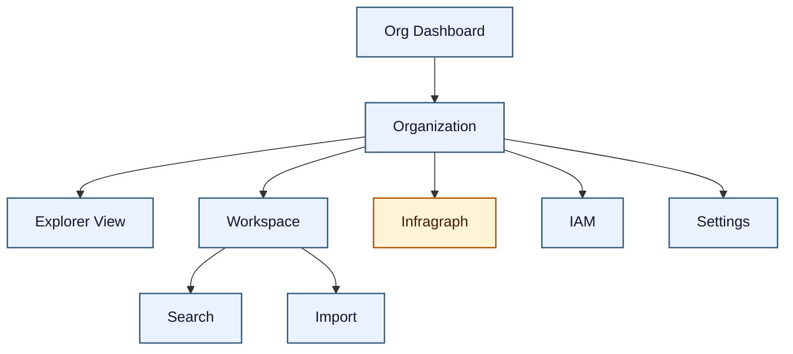
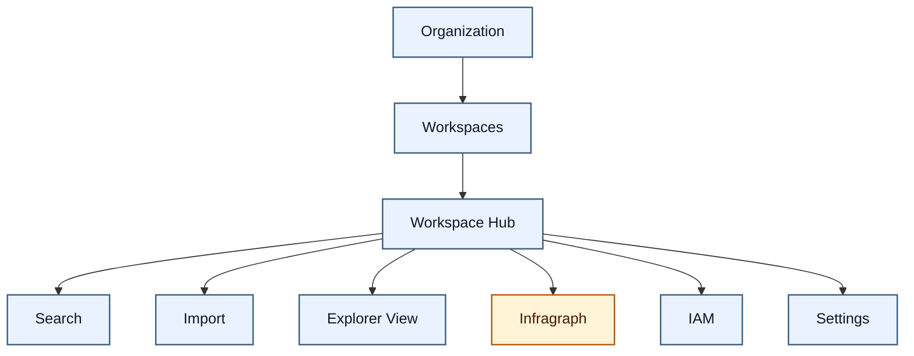

# 003.26.04.03.Skyway Architecture Mermaid Diagrams

**Date**: 2026-04-03  
**Author**: GitHub Copilot  
**Status**: Draft  
**Grounded in**: [001.26.04.02.Skyway-Merge-IA-Diagrams.md](./001.26.04.02.Skyway-Merge-IA-Diagrams.md), [002.26.04.02.OptionA-OptionB-ClickablePrototype-Plan.md](./002.26.04.02.OptionA-OptionB-ClickablePrototype-Plan.md), [HCP Terraform UI Quick Reference](./hcp-tf-ui-for-agents/quick-reference.md), [HCP Terraform UI README](./hcp-tf-ui-for-agents/README.md)

## Scope

This artifact turns the three architecture variants into Mermaid diagrams:

1. Current Terraform today, with Infragraph shown as an external surface.
2. Option A - org-first.
3. Option B - workspace-centric.

## Interpretation Notes

- The baseline uses the current Terraform navigation from the local UI reference.
- Infragraph stays outside the core Terraform tree because the workshop baseline separates it from Terraform's current navigation.
- Option B follows the corrected reading in `001.26.04.02.Skyway-Merge-IA-Diagrams.md`: no new multi-org dashboard, workspace is the main operating surface.
- The older prototype plan includes an Option B org dashboard route for testing. This diagram set follows the corrected IA note instead of that older route scaffold.

## Diagram 1 - Current Terraform Today + External Infragraph

## Diagram 2 - Option A - Org-First

## Diagram 3 - Option B - Workspace-Centric

## Export Assets

Raw Mermaid source files live in `output/figma/`.

The SVG exports in the same folder are intended for Figma import.

- Combined Figma board: `output/figma/skyway-architectures-figma-board.svg`
- Individual baseline SVG: `output/figma/current-terraform-with-external-infragraph.svg`
- Individual Option A SVG: `output/figma/option-a-org-first.svg`
- Individual Option B SVG: `output/figma/option-b-workspace-centric.svg`