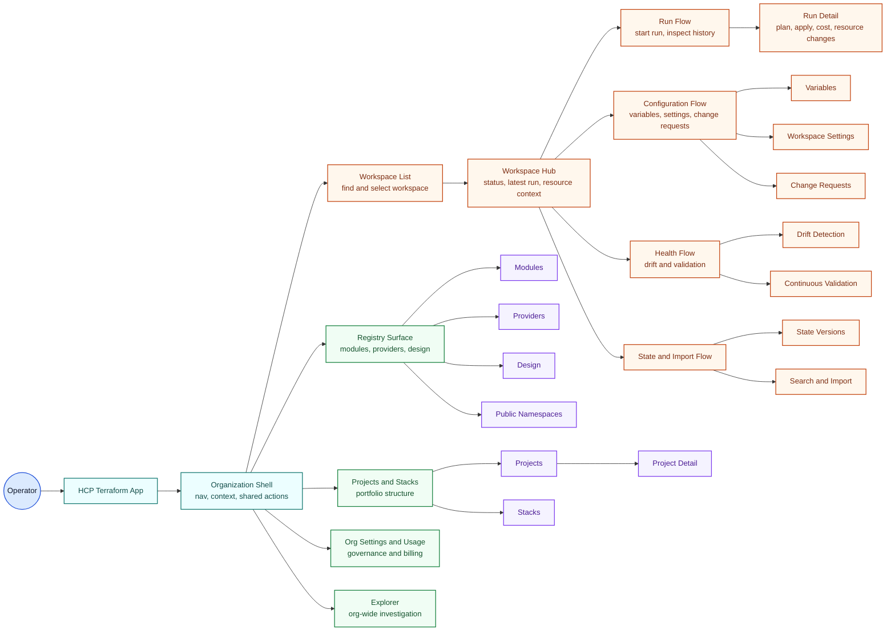

# 005.26.04.06 HCP Terraform UI Architecture User Flows

**Date**: 2026-04-06  
**Author**: GitHub Copilot  
**Status**: Draft  
**Grounded in**: [HCP Terraform UI Quick Reference](./hcp-tf-ui-for-agents/quick-reference.md), [HCP Terraform UI README](./hcp-tf-ui-for-agents/README.md)

## Scope

This diagram reframes the HCP Terraform documentation as an architectural user-flow map.

It emphasizes:

1. The operator entering the product through the organization shell.
2. The workspace operating loop for inspection, change, and remediation.
3. Secondary organization flows for registry, projects, and settings.

## Diagram

## Notes

- This is an interaction architecture view, not a route-complete site map.
- The workspace hub is treated as the main operating center because the documentation positions the workspace overview as the core workspace entry.
- Organization-level surfaces stay visible because the product also supports registry, governance, billing, and portfolio management outside the workspace loop.